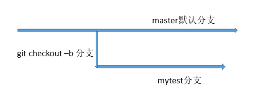
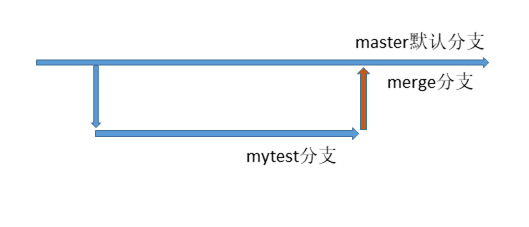

## 第六课 创建分支、分支的合并、变基操作

git的一个巨大优点就是创建分支、分支间切换、分支的合并很容易。

当一个项目已经稳定运行，需要开发某些特性或新版本时，可以创建一个新的分支，在分支中开发，而不去影响已有的稳定项目。


1. 创建一个分支

在第四课的目录下进行，先同步最近的代码，然后创建并切换到一个新分支 mytest。
````
[james@linux ilovegit]$ cd ~/ilovegit/
[james@linux ilovegit]$ git pull upstream master
From https://github.com/bg6cq/ilovegit
 * branch            master     -> FETCH_HEAD
Already up-to-date.
[james@linux ilovegit]$ git checkout -b mytest
Switched to a new branch 'mytest'
[james@linux ilovegit]$ git branch
  master
* mytest
````
`git branch`显示"* mytest"说明已经处于mytest分支。

2. 在分支mytest中修改

修改文件，可以用vi，以下命令演示文件修改和git diff/git status，以及如何将分支提交给服务器：
````
[james@linux ilovegit]$ echo "这是分支mytest的修改" >> README.md
[james@linux ilovegit]$ git diff
diff --git a/README.md b/README.md
index 5ec1b16..04d08a6 100644
--- a/README.md
+++ b/README.md
@@ -5,3 +5,4 @@
 我喜欢git，我是来自中国科大的测试用户。

 我喜欢git，我是来自四川托普职院的用户。
+这是分支mytest的修改
[james@linux ilovegit]$ git status
# On branch mytest
# Changes not staged for commit:
#   (use "git add <file>..." to update what will be committed)
#   (use "git checkout -- <file>..." to discard changes in working directory)
#
#       modified:   README.md
#
no changes added to commit (use "git add" and/or "git commit -a")
[james@linux ilovegit]$ git add README.md
[james@linux ilovegit]$ git commit -m "mytest branch test"
[mytest 706b7ca] mytest branch test
 1 file changed, 1 insertion(+)
[james@linux ilovegit]$ git push origin mytest
Counting objects: 12, done.
Delta compression using up to 8 threads.
Compressing objects: 100% (7/7), done.
Writing objects: 100% (10/10), 1007 bytes, done.
Total 10 (delta 3), reused 0 (delta 0)
remote: Resolving deltas: 100% (3/3), completed with 1 local object.
To git@github.com:zhangyunkai/ilovegit.git
 * [new branch]      mytest -> mytest
````

最后的`git push origin mytest`是把分支提交到服务器。

这时登录自己的 https://github.com/XXXX/ilovegit ，在branches下可以看到mytest分支里文件内容有变化，master分支中仍旧是旧的文件。




3. 分支的合并

当分支的开发基本完成，可以稳定运行后，应该把修改应用到master中，就叫做合并。当然合并也可以在其他分支之间发生。

在mytest分支中，README.md 中增加内容"我喜欢git，也喜欢GitHub，我是来自中国科大的测试用户。"并提交到服务器。

登录服务器查看，mytest分支的内容是"我喜欢git，也喜欢GitHub，我是来自中国科大的测试用户。"

而master分支还是"我喜欢git，我是来自中国科大的测试用户。"

分支的合并很简单拿，只要切换到master分支，merge mytest，然后把master分支提交到服务器。
````
[james@linux ilovegit]$ git checkout master
Switched to branch 'master'
[james@linux ilovegit]$ git merge mytest
Updating 983962c..2170f78
Fast-forward
 README.md | 2 +-
 1 file changed, 1 insertion(+), 1 deletion(-)
[james@linux ilovegit]$ more README.md
## git 学习宣言

我喜欢git，我是来自中国科大的张焕杰。

我喜欢git，也喜欢GitHub，我是来自中国科大的测试用户。

我喜欢git，我是来自四川托普职院的用户。
[james@linux ilovegit]$ git push origin master
Total 0 (delta 0), reused 0 (delta 0)
To git@github.com:zhangyunkai/ilovegit.git
   983962c..2170f78  master -> master
````

4. 分支的rebase

分支是从创建的时候从某个分支（假定是master分支，称为base基）分叉出来的。如果过了一段时间，在分支中做了修改，原来的master分支也做了修改，我们希望把分支的修改直接应用到
现在的master分支（当然也就包含了master分支的修改），这个操作叫rebase变基。

假定我们在master里增加"我喜欢git，我是来自火星上的测试用户。"

下面是变基操作：
````
[james@linux ilovegit]$ git checkout master
Switched to branch 'master'
Your branch is ahead of 'origin/master' by 1 commit.
  (use "git push" to publish your local commits)
[james@linux ilovegit]$ cat README.md
## git 学习宣言

我喜欢git，我是来自中国科大的张焕杰。

我喜欢git，也喜欢GitHub，我是来自中国科大的测试用户。

我喜欢git，我是来自四川托普职院的用户。

我喜欢git，我是来自火星的用户。
[james@linux ilovegit]$ git add README.md
[james@linux ilovegit]$ git commit -m "change in master"
[master a88b59e] change in master
 1 file changed, 2 insertions(+)
[james@linux ilovegit]$ git checkout mytest
Switched to branch 'mytest'
[james@linux ilovegit]$ vi README.md
[james@linux ilovegit]$ cat README.md
## git 学习宣言

我喜欢git，我是来自中国科大的张焕杰。

我喜欢git，也喜欢GitHub，我是来自中国科大的测试用户。

我喜欢git，我是来自四川托普职院的用户。

我喜欢git，我是来自CERNET的用户。
[james@linux ilovegit]$ git add README.md
[james@linux ilovegit]$ git commit -m "change in mytest"
[mytest 762c5aa] change in mytest
 1 file changed, 2 insertions(+)
[james@linux ilovegit]$ git rebase master
First, rewinding head to replay your work on top of it...
Applying: change in mytest
Using index info to reconstruct a base tree...
M       README.md
Falling back to patching base and 3-way merge...
Auto-merging README.md
CONFLICT (content): Merge conflict in README.md
Failed to merge in the changes.
Patch failed at 0001 change in mytest
The copy of the patch that failed is found in:
   /home/users/james/ilovegit/.git/rebase-apply/patch

When you have resolved this problem, run "git rebase --continue".
If you prefer to skip this patch, run "git rebase --skip" instead.
To check out the original branch and stop rebasing, run "git rebase --abort".
````
由于我们在相同的位置做了修改，合并会引起冲突。

编辑文件 README.md，把冲突的地方修改，git add/commit，然后git rebase --skip，总之按照提示操作。

完成后可以在  https://github.com/XXXX/ilovegit ，在"Insights/Network"下看到分支的有向图。

5. 分支的删除

一个分支合并到其他分支后，如果不再需要，可以删除。
````
git branch -D branch_name
````

服务器端的分支，可以在web界面删除，也可以使用下面的命令删除：
```
git push origin :branch_name
```


## 课程完成检查点

1. 创建分支，并把分支的修改推送到服务器

2. 在github上可以看到分支的有向图

  这时登录自己的 https://github.com/XXXX/ilovegit ，在"Insights/Network"下，可以看到分支的有向图，更加直观。
