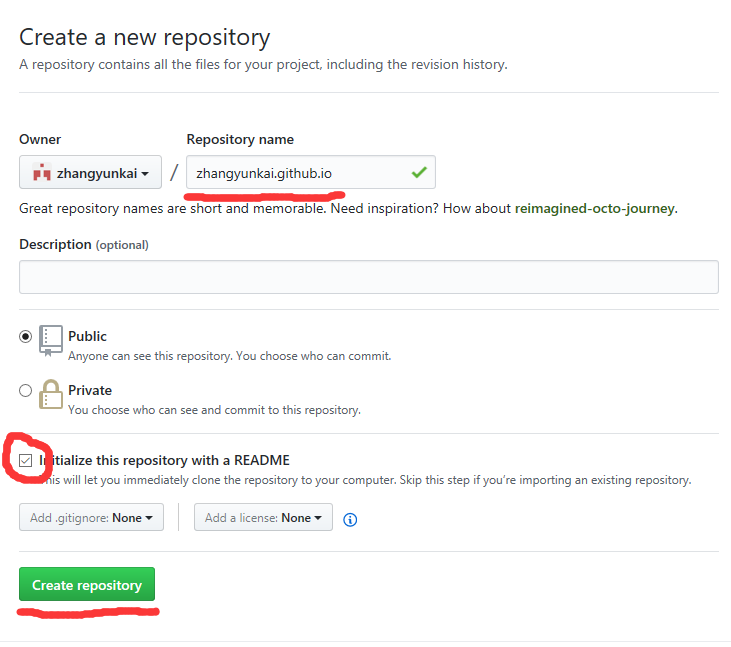
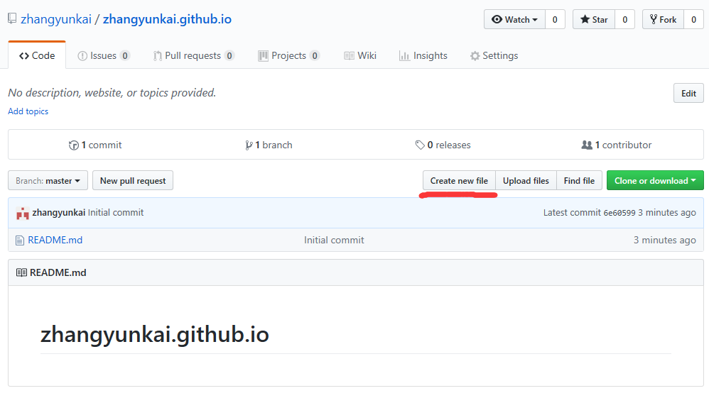
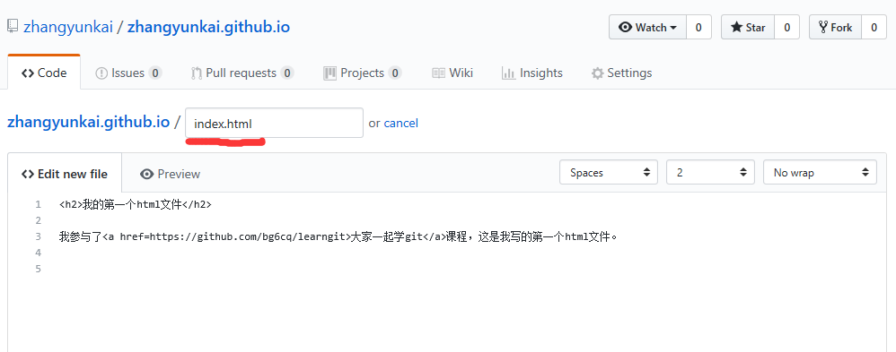

## 第七课 使用GitHub Pages建立自己的主页

Github Pages 是 github 公司提供的免费的静态网站托管服务，用起来方便而且功能强大。

最为关键的是，页面完全是你控制的，github公司不会放任何内容（包括广告）在上面，不仅没有空间限制，还可以绑定自己的域名。

建立自己的主页非常简单：

1. 登录GitHub

浏览器访问 [https://github.com](https://github.com), 单击 "Sign in", 输入自己账号、
密码，登录Github。如果已经登录，请忽略这一步。

2. 新建一个项目

单击右上角+图标，弹出的下拉框中，单击"New repository"，如下图所示：


输入项目名字，名字是 "登录名.github.io"，其中登录名是你的 github账号，注意大小写要完全一样。

注意选择“Initialize this repository with a README”，以便生成第一个README文件后，方便使用github web界面编辑文件。

如果没有选择这个选项，可以删除重建，或者按照“第三课 新建项目，跟踪自己的修改”，在自己在机器上一个目录编辑index.html文件传到项目中来。

单击如下图所示：



完成项目创建。

3. 添加index.html文件

如果选择“Initialize this repository with a README”，项目库中有了文件，可以在github界面直接新增index.html文件，
单击"Create new file"，如下图所示：



在弹出的页面中，文件名输入`index.html`，文件内容输入以下内容：
```
<h2>我的第一个html文件</h2>

我参与了<a href=https://github.com/bg6cq/learngit>大家一起学git</a>课程，这是我写的第一个html文件。
```
如下图所示：



单击最下方的"Commit new file"保存文件。

4. 查看自己的主页文件

访问 http://xxxx.github.io (xxxx是你的登录名，注意最后是.io)，可以看到刚刚修改的主页。

5. 设定自己的域名

如果你有自己的域名，还可以设置自己的域名，将来使用自己的域名访问。具体操作请搜索"github pages"。


## 课程完成检查点

1. 自己的主页可以访问